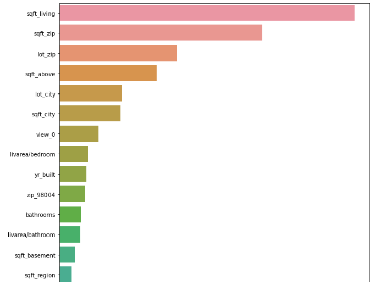

# Washington Housing Prices

The valuation of residential properties can take a huge chunk of time. Machine learning models can be used in production to assist real estate agents in swiftly estimating house values based on several house properties. On the consumer side, it promotes transparency by allowing home buyers to view current and historical property details.

## Problem Statement
The goal of this project is to forecast house values in Washington based on the characteristics of these properties.

## About The Data
- The Data contains 4600 entries and 16 columns including the house prices
- There are 3 non-numerical columns and 13 numerical columns
- There are no missing values in the data
- The average house price in the dataset is 551,963
- The least price in the dataset is $0 while the most expensive house costs 26,590,000
- The oldest house was built in year 1900 while the newest house was built in 2014

## Data Preprocessing
The data was split into train and test sets (in the ratio 3 to 1) before passing the train set through the following proprocessing stages:
- Outliers Removal: two extreme values were removed
- Feature Extraction and Engineering: new features were created from existing features (e.g the **quadrant** and **road_type** columns were created from the **street** feature
- Feature Scaling: Skewed features were normalized while  wide-range features were simply scaled
- Category Encoding: Some categorical features were dummy encoded while ordinal categories were used directly
The whole preprocessing steps were bundled into a single pipeline

## Model Training and Evaluation
Linear and Tree-based models were trained on the preprocessed data. The gradient boosting algorithms produced encouraging results, with CatBoostRegressor outperforming the others on unseen data with an error of around 93,000. Most of the models suffered from overfitting..

## Conclusion
**Size, location, condition, and amenities** are some of the most important considerations for home purchasers when determining which property to buy.

## Next Steps
- The models could benefit from hyperparameters tuning
- Wrapping everything in docker to make the work reproducible
- Productionizing the final model
